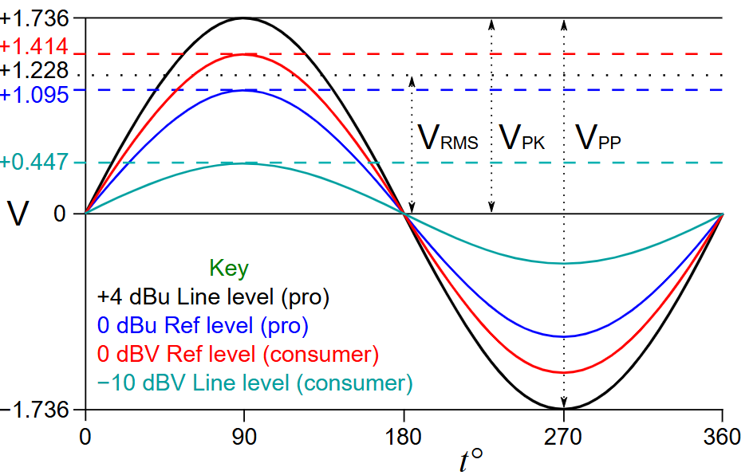
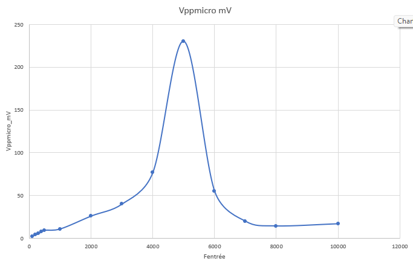
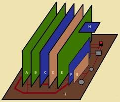
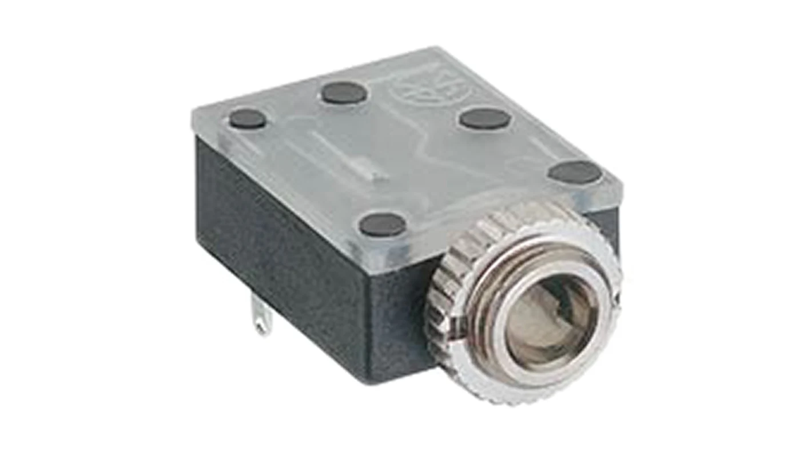
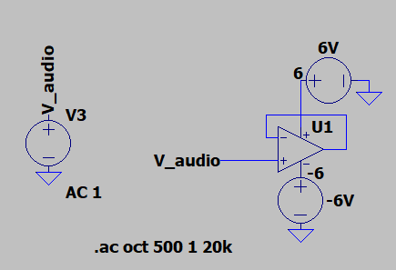

## TOC
- [Table-de-Mixage :  Conditionnement de signal](#table-de-mixage---conditionnement-de-signal)
- [I. Introduction](#i-introduction)
- [II. Modules](#ii-modules)
  - [A. Alimentation](#a-alimentation)
    - [1. Microcontrôleur :](#1-microcontrôleur-)
      - [i. USB :](#i-usb-)
      - [ii. 3.3V externe](#ii-33v-externe)
      - [iii. VIN ou +5V](#iii-vin-ou-5v)
    - [2. Circuit](#2-circuit)
      - [i. $0V;12V$](#i-0v12v)
      - [ii. $-6V;+6V$](#ii--6v6v)
    - [3. Connecteur alimentation](#3-connecteur-alimentation)
  - [B. Connecteur entrée analogique](#b-connecteur-entrée-analogique)
  - [C. Synchronisation](#c-synchronisation)
    - [1. Que signifie la synchronisation ?](#1-que-signifie-la-synchronisation)
    - [2. Comment savoir si le retard est exprès ou pas?](#2-comment-savoir-si-le-retard-est-exprès-ou-pas)
    - [3. Alors comment synchroniser les signaux analogiques ou comment les signaux analogiques sont synchronisé généralement?](#3-alors-comment-synchroniser-les-signaux-analogiques-ou-comment-les-signaux-analogiques-sont-synchronisé-généralement)
      - [i. Calibration:](#i-calibration)
      - [ii. le chemin du signal](#ii-le-chemin-du-signal)
      - [iii. Ajuster la phase](#iii-ajuster-la-phase)
      - [iv. Utilisation d'un signal de référence ou oscilloscope :](#iv-utilisation-dun-signal-de-référence-ou-oscilloscope-)
  - [D. Entrée haute impedance](#d-entrée-haute-impedance)
    - [1. Pourquoi?](#1-pourquoi)
    - [2. Solution circuit suiveur avec AOP :](#2-solution-circuit-suiveur-avec-aop-)
      - [i. Principe du circuit suiveur avec AOP](#i-principe-du-circuit-suiveur-avec-aop)
      - [ii. Caractéristiques d'un suiveur](#ii-caractéristiques-dun-suiveur)
      - [iii. Pourquoi utiliser un suiveur ?](#iii-pourquoi-utiliser-un-suiveur-)
      - [iv . Montage](#iv--montage)
  - [E. Filtre en Entrée](#e-filtre-en-entrée)
    - [1. Prévision d'une modularité pour le filtre](#1-prévision-dune-modularité-pour-le-filtre)
      - [i. Caractéristiques idéales du filtre à concevoir](#i-caractéristiques-idéales-du-filtre-à-concevoir)
      - [ii. Exemples de filtres possibles :](#ii-exemples-de-filtres-possibles-)
  - [F. Detection de Niveau + Adaptation de Niveau](#f-detection-de-niveau--adaptation-de-niveau)
  - [G. Indicateur de niveau](#g-indicateur-de-niveau)
  - [H. Selection Voie](#h-selection-voie)
  - [I. Amplification](#i-amplification)
  - [J. Interface utilisateur et retour d’état](#j-interface-utilisateur-et-retour-détat)
  - [K. Sécurité](#k-sécurité)
  - [L. Optimisation et validation finale](#l-optimisation-et-validation-finale)
  - [M. Tests à réaliser pour validation](#m-tests-à-réaliser-pour-validation)

# Table-de-Mixage :  Conditionnement de signal 

# I. Introduction 
Pour notre Table de Mixage nous avons besoins de (au moins) 2 entrées analogiques.
Cette partie de Projet est sur le conditionnement de ces signaux pour avoir un signal dans la plage de tension de notre entree de ADC [0; 3.3V].

Deux types de signaux sont possibles : 
- Amplifié niveau ligne(ref level (consumer)) [ $1.414 Vpk$ ] ou [ $1.736Vpk$ ] ou [ $3.3Vpp$ ]

- Non Amplifié ( entre niveau micro et niveau ligne)

Mesures sur  Micro : 
On fait des mesures de tension sur notre  signale de micro pour avoir une idée de ce qu'on peux avoir en sortie d'un micro.

   | $f_{\text{entrée}}[Hz]$ | $Vpp_{\text{micro}}[mV]$ |
   | :---------------------: | :----------------------: |
   |           100           |           2.5            |
   |           200           |            4             |
   |           300           |           5.5            |
   |           400           |            8             |
   |           500           |           9.5            |
   |          1000           |            11            |
   |          2000           |            26            |
   |          3000           |            40            |
   |          4000           |            77            |
   |          5000           |           230            |
   |          6000           |            55            |
   |          7000           |            20            |
   |          8000           |           14.5           |
   |          10000          |            17            |

> [lien vers Excel](https://1drv.ms/x/c/44e5248c228d5751/ETUEaSnJRSJNqgbVf3nIVEgBYADid3KxOARgrQHJ6OK-Tg?e=khQeDF)

Dans les deux cas il faudrait amplifier et mettre un offset sur le signal pour être dans la plage de notre ADC de microcontrôleur.

#  II. Modules 
Pour la conception de notre sous-système, nous adoptons une approche modulaire. Cette méthodologie facilite le développement, la maintenance et l'évolution du système.

Deux approches principales peuvent être utilisées :
- Approche verticale

   

- Approche horizontale

   

## A. Alimentation
Pour notre circuit d'entree analogique nous avons besoins de plusieurs tension d'alimentation 
### 1. Microcontrôleur :
https://www.st.com/resource/en/user_manual/um1956-stm32-nucleo32-boards-mb1180-stmicroelectronics.pdf

Le pont de soudure SB1 détermine si l'alimentation 5 V provient du ST-LINK intégré (via USB) ou d'une source externe.

Data-sheet : Section 6.4.1 Table 4 :
#### i. USB : 
SB1(OFF)100mA ou SB1(ON) 300mA
> [!CAUTION]
> Si la consommation de courant maximale de la carte STM32 Nucleo-32 et de sa carte shield dépasse 300 mA, il est obligatoire d'alimenter la carte STM32 Nucleo-32, en utilisant une alimentation externe connectée au VIN, +5 V ou +3V3.

> [!NOTE]
> Dans le cas où la carte est alimentée par un chargeur USB, il n'y a pas d'énumération USB, donc la LED LD2 reste éteinte en permanence et la cible STM32 n'est pas alimentée. Dans ce cas précis, la SB1 doit être réglée sur on, pour permettre à la cible STM32 d'être alimentée quand même.

#### ii. 3.3V externe
> [!CAUTION] 
> Lorsque la carte est alimentée par +3V3 (broche 14 CN4), le pont de soudure SB14 et SB9 (NRST) doit être éteint.

| Nom alimentation | Connector pin | Plage tension [$V$] | Max courant [$mA$] | Limitation                                                      |
| ---------------- | ------------- | ------------------- | ------------------ | --------------------------------------------------------------- |
| $+3V3$           | CN4 pin 14    | $3 V \ à \ 3.6 V$   | -                  | ST-LINK n'est pas alimenté et SB14 et SB9 doivent être éteints. |

#### iii. VIN ou +5V

| Nom alimentation | Connector pin | Plage tension [$V$]   | Max courant [$mA$] | Limitation                                                                                                                                                                                                                                                                                          |
| ---------------- | ------------- | --------------------- | ------------------ | --------------------------------------------------------------------------------------------------------------------------------------------------------------------------------------------------------------------------------------------------------------------------------------------------- |
| $V_{IN}$         | CN4 pin 1     | $7 V \ à \ 12 V$      | $800 mA$           | De $7 V$ à $12 V$ uniquement et la capacité de courant d'entrée est liée à la tension d'entrée :   - $I = 800 mA$ Courant d'entrée lorsque $V_{IN} = 7 V$   - $I = 450 mA$ lorsque $7 V < VIN < 9 V$   - $I = 300 mA$ lorsque $10 V> VIN > 9 V$   - $I \lt 300 mA$ lorsque $VIN > 10 V$ |
| $+5 V$           | CN4 pin 4     | $4.75 V \ à \ 5.25 V$ | $500 mA$           | ST-LINK non alimenté                                                                                                                                                                                                                                                                                |

En cas d'alimentation par $VIN$ ou $+5V$, il est toujours possible d'utiliser ST-LINK pour la communication à des fins de programmation ou de débogage uniquement, mais il est obligatoire d'alimenter d'abord la carte, en utilisant $VIN$ ou $+5V$, puis de connecter le câble USB au PC. De cette façon, l'énumération réussira de toute façon, grâce à la source d'alimentation externe.

La séquence d'alimentation suivante doit être respectée : 
- Vérifiez que SB1 est éteint.
- Connectez la source d'alimentation externe à $VIN$ ou $+5V$.
- Mettez sous tension l'alimentation externe $7 V< VIN < 12 V$ à $VIN$, ou $5V$ pour $+5V$. 
- Vérifiez que la LED rouge LD2 est allumée.
- Connectez le PC au connecteur $USB \  CN1$

> [!CAUTION] 
>Si cet ordre n'est pas respecté, la carte peut être alimentée d'abord par $V_{BUS}$, puis par $V_{IN}$ ou $+5V$, et les risques suivants peuvent être rencontrés :
>- Si la carte a besoin de plus de $300 mA$ de courant, le PC peut être endommagé ou le courant fourni est limité par le PC. En conséquence, la carte n'est pas alimentée correctement.
>- $300 mA$ sont demandés à l'énumération (puisque SB1 doit être éteint) il y a donc un risque que la demande soit rejetée et que l'énumération échoue si le PC ne peut pas fournir ce courant. En conséquence, la carte n'est pas alimentée (la LED LD2 reste éteinte).
### 2. Circuit 
#### i. $0V;12V$
#### ii. $-6V;+6V$
### 3. Connecteur alimentation

## B. Connecteur entrée analogique 

Pour l'instant nous avons decides d'utiliser un connecteur jack 3.5mm avec 3 poles.

   

> lien : [Connecteur Jack 3,5 mm Femelle Lumberg, Montage sur CI, 3 Pôles](https://fr.rs-online.com/web/p/connecteurs-jacks/9092238)

## C. Synchronisation 
La synchronisation des signaux audio consiste généralement à les **aligner dans le temps** afin qu'ils puissent jouer ensemble de manière harmonieuse sans retards ou décalages involontaires.

### 1. Que signifie la synchronisation ?
Alignement temporel :
- Les signaux doivent démarrer au bon moment les uns par rapport aux autres.
- Par exemple, si un instrument joue un rythme et qu'un autre est censé le rejoindre une seconde plus tard, les signaux doivent refléter ce timing avec précision.

Cohérence de phase :
- Si les signaux font partie de la même performance (par exemple, deux microphones capturant le même instrument ou ensemble), ils ne doivent pas avoir de différences de phase qui pourraient provoquer des interférences (par exemple, écho, annulations).

Cohérence entre les appareils :
- Lors des concerts, plusieurs instruments ou sources sonores sont souvent mixés. Ces signaux sont synchronisés pour garantir qu'ils sont joués en synchronisation avec le tempo et le rythme globaux.

Dans notre cas :
Si l'un des instruments commence en retard ou en avance, la musique risque de ne pas sonner comme prévu. Mais dans le cas des signaux analogiques nous n'avons pas le moyen de savoir si l'utilisateur joue délibérément avec retard ou c'est un facteur externe qui ajoute le retard sur les signaux.

### 2. Comment savoir si le retard est exprès ou pas?
>    
>  
 
> ........ InProgress .........
> 
>  

>    
> 

### 3. Alors comment synchroniser les signaux analogiques ou comment les signaux analogiques sont synchronisé généralement?
#### i. Calibration:
On peux faire une calibration au démarrage de tous les instruments pour les synchroniser sur un signal de démarrage (start pulse) et prendre ne compte le retard ou latence sur ces signaux par rapport au signal de démarrage.

#### ii. le chemin du signal
Une des moyens c'est d'assurer que les deux signaux mettent le même temps pour se déplacer de leurs sources (instruments) au point de mixage.

Facteurs à prendre en compte :
- Longueurs de câble : les câbles longs peuvent introduire de petits retards.
- Traitement du signal : les effets analogiques tels que les égaliseurs ou les unités de réverbération peuvent ajouter de la latence.
- Utilisation des chemins de signal identiques ou correctement compensés pour les deux instruments.

#### iii. Ajuster la phase
Si les signaux semblent mal alignés, nous pouvons utiliser un déphaseur pour les aligner correctement. Cela garantira que les pics et les creux des formes d'onde s'alignent lorsqu'ils sont mixés.
  

 
  
  
........ InProgress .........

 

  

#### iv. Utilisation d'un signal de référence ou oscilloscope :
Nous pouvons utiliser une référence (par exemple, [une piste de clic ](https://moises.ai/fr/blog/astuces/qu-est-ce-qu-une-piste-de-click/ "https://moises.ai/fr/blog/astuces/qu-est-ce-qu-une-piste-de-click/") ou un oscilloscope visuel) pour s'assurer que les signaux sont correctement alignés et ajuster leur synchronisation et leur phase jusqu'à ce que les formes d'onde s'alignent comme prévu.

>[!NOTE]
> Pour ajouter un retard sur nos signaux analogiques (pour les synchroniser) nous pouvons utiliser un filtre passe tout qui ajoute un déphasage sur les signaux.

## D. Entrée haute impedance

Pour nos signaux, il est nécessaire d'utiliser une source ayant une impédance de sortie faible ($entre \ R = 100 \Omega \ et \ R = 600 \Omega$) afin de minimiser les pertes de signal. L'entrée, quant à elle, doit présenter une impédance élevée ($R \gt 10k \Omega$) pour éviter de charger la source et garantir un bon transfert du signal.

### 1. Pourquoi? 
- Adaptation d'impédance (Source - Charge) : 
Impedance de source faible (basse impédance) : Une source avec une faible impédance($entre \ R = 100 \Omega \ et \ R = 600 \Omega$)  est capable de fournir plus de courant sans pertes importantes. Cela permet de compenser les pertes dues à la résistance de la source elle-même, qui pourraient autrement atténuer le signal transmis.
Impedance d'entrée élevée : L'entrée doit avoir une impédance élevée (généralement $R \gt 10k \Omega$) pour minimiser le courant qui va passer dans l'entrée. Si l'impédance d'entrée est trop faible, elle "charge" la source, c'est-à-dire qu'elle tire trop de courant, ce qui peut déformer le signal ou réduire son amplitude.

- Entrée à haute impédance
Minimiser la charge sur la source : Si l'impédance d'entrée est trop basse, elle va "tirer" trop de courant de la source, ce qui peut perturber le signal et le déformer. Par exemple, une faible impédance d'entrée va créer une baisse de tension significative à la sortie de la source, réduisant ainsi la qualité du signal.
Préserver l'intégrité du signal : Une haute impédance d'entrée assure que la quantité de courant demandée par l'entrée est minimale, de sorte que le signal source n'est pas trop perturbé. Cela permet à la source de conserver la qualité du signal sans trop de pertes de puissance.

- Minimisation de la distorsion :
Une adaptation d'impédance incorrecte peut également entraîner une distorsion du signal. Cela se produit car une source avec une impédance trop élevée par rapport à l'entrée pourrait avoir du mal à fournir un signal stable. À l'inverse, une entrée avec une impédance trop faible pourrait « siphonner » trop de courant de la source, ce qui entraînerait une diminution du signal et des déformations.

### 2. Solution circuit suiveur avec AOP : 

#### i. Principe du circuit suiveur avec AOP
- Un suiveur de tension est un montage où la sortie de l'AOP est directement connectée à son entrée inverseuse (−).
- L'entrée non-inverseuse (+) reçoit le signal que l'on souhaite transmettre.
- La tension de sortie est égale à la tension d'entrée, c'est-à-dire $V_{out}=V_{in}$.
 
#### ii. Caractéristiques d'un suiveur
- Impédance d'entrée très élevée :
    - L'entrée de l'AOP (côté non-inverseur) a une impédance extrêmement élevée, souvent de l'ordre de plusieurs mégaohms ($M\Omega$). Cela garantit que le circuit n’exerce pratiquement aucune "charge" sur la source.
    - La source ne subit qu'une très faible demande de courant, ce qui évite d'affaiblir le signal.
  
- Impédance de sortie très faible :
  - L'AOP peut fournir un courant important grâce à ses caractéristiques internes. Son impédance de sortie est très faible (souvent inférieure à  $1\Omega$). Cela garantit que la charge suivante reçoit un signal stable, même si elle a une impédance faible.
- Gain unitaire ($G=1$) :
  - Le suiveur ne modifie pas l'amplitude du signal. La tension en sortie est une copie conforme de la tension en entrée.

#### iii. Pourquoi utiliser un suiveur ?
- Isolation des impédances :
  - Le suiveur permet d'isoler une source à impédance élevée (par exemple un capteur ou un diviseur de tension) d'une charge à impédance faible. Cela évite les pertes de signal.

- Protection de la source :
  - Une source fragile, comme un capteur sensible ou une antenne, n'a pas besoin de fournir beaucoup de courant. Le suiveur agit comme un intermédiaire, protégeant la source tout en transmettant le signal.
  
- Stabilité et fiabilité : 
  - Le suiveur garantit un transfert de signal sans déformation ni chute de tension, même si la charge varie.

#### iv . Montage

 

## E. Filtre en Entrée

Un filtre en entrée n'est pas nécessaire dans l'état actuel du projet pour les raisons suivantes :

- **Plage audible non affectée :** Dans la plage des sons audibles (20 Hz à 20 kHz), l'ajout ou l'absence d'un filtre passe-bande n'entraîne aucune différence perceptible. En dehors de cette plage, le signal n'est pas audible, ce qui rend le filtre superflu pour cette application.
- **Effet négatif du filtre :** Les filtres peuvent introduire une phase qui n'est ni constante ni linéaire, ce qui peut provoquer des distorsions ou des décalages dans le signal.

### 1. Prévision d'une modularité pour le filtre
Bien que le filtre ne soit pas indispensable pour le moment, nous incluons une **place modulaire** sur la carte pour permettre l'ajout d'un filtre à l'avenir si nécessaire. Cette flexibilité sera utile dans les cas suivants :
- Si le signal d'entrée qui vient d'un DAC (convertisseur numérique-analogique) nécessite un filtrage supplémentaire, par exemple, pour supprimer la fréquence d'échantillonnage.
- Selon les besoins, un **filtre passe-bas** ou **passe-bande** pourra être inséré.

Si aucun filtrage n'est requis, un module simple reliant directement l'entrée à la sortie via un fil pourra être utilisé.

Cette approche garantit la compatibilité future tout en évitant des ajouts inutiles à ce stade.

Outil pour trouver designer filtres :
[Analog Filter Wizard](https://tools.analog.com/en/filterwizard/)

#### i. Caractéristiques idéales du filtre à concevoir

Les caractéristiques principales du filtre sont définies comme suit :

- Gain : 1  
- Phase : 0°  
- Fréquence maximale ($f_{max}$) :  
  - $f_{max} \leq 20 \, \text{kHz}$  
  - Il est possible de dépasser cette fréquence tant que cela reste inférieur aux fréquences parasites, n’atténue pas le son, et respecte les conditions précédentes.  
- Fréquence minimale ($f_{min}$) :  
  - $f_{min} \geq 0 \, \text{Hz}$  
  - Il est possible de dépasser cette fréquence tant que cela reste supérieur aux fréquences parasites, n’atténue pas le son, et respecte les conditions précédentes.

#### ii. Exemples de filtres possibles :
  - Passe-bas :
    - $f_{max} \leq 15 \, \text{kHz}$  

  - Passe-bande :  
    - $f_{max} \leq 15 \, \text{kHz}$  
    - $f_{min} \geq 50 \, \text{Hz}$

## F. Detection de Niveau + Adaptation de Niveau

## G. Indicateur de niveau

........ InProgress .........

## H. Selection Voie

........ InProgress .........

## I. Amplification

........ InProgress .........

## J. Interface utilisateur et retour d’état
   

........ InProgress .........

## K. Sécurité 

........ InProgress .........

## L. Optimisation et validation finale

........ InProgress .........

## M. Tests à réaliser pour validation

........ InProgress .........

