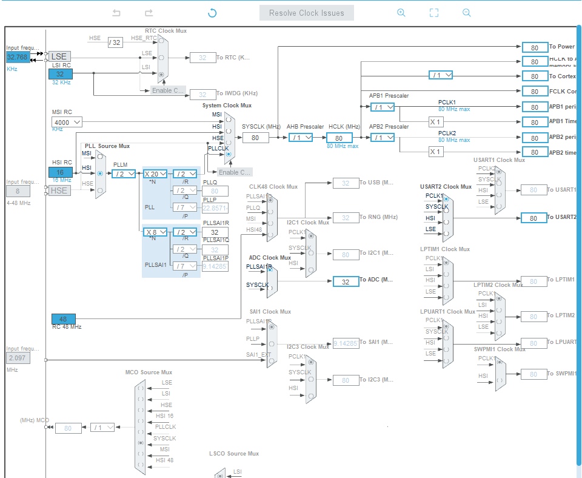
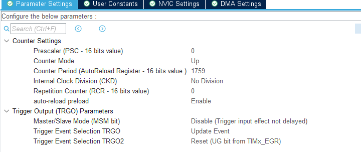

# Table-de-Mixage

Pour notre Table de Mixage nous avons besoins de convertir les signal analogique dans un signal "traitable"/Numérique par nos programmes. Nous avons plusieurs solutions possible pour cette fonctionnalité : 
- ADC Externe contrôlé par notre Raspberry.
- Un microcontrôleur qui a un ADC donc on utilise ça pour traiter les données et les envoyer a notre Raspberry.

Nous avons décidé de choisir un STM32-Nucleo-L432KC qui était deja disponible.
La liste des fonctionnalités a mettre dans le programme :

### 1. Initialisation du système
- [x] Initialisations des pins importants (SWDIO, SWCLK ...etc) 
  - [x] RCC In & Out : PC14 & PC15 
  - [X] ADC1_IN5 : PA0
  - [x] ADC1_IN6 : PA1
  - [x] GPIO_OUT : PB3 : LED3  
  - [x] SWDIO & SWCLK > Debug - Serial Wire : PA14 & PA13
  - [x] USART2 Async: PA2; PA3
- [x] Clock Configuration (RCC, HSE, PLL, etc.).
  - [x] Clock config : 
- [x] Mise en place d’un gestionnaire d’interruptions (si nécessaire, NVIC & EXTI....).
  - [x] RCC global interrupt
  - [x] TIM1 Update Event

- [x] Test initial pour s’assurer que la carte est correctement alimentée et fonctionnelle 
  - [x] par exemple, faire clignoter LED3 sur la carte 
    > Programme blink 
### 2. Configuration de l'ADC (Analog-to-Digital Converter)
#### 2.1. ADC : 
- [x] ADC : ADC1
- [x] CLK : Async clk / 1
- [x] Résolution de l'ADC :  12 bits
- [x] Canaux d'entrée : IN5 & IN6
- [x] Mode : Scan Conversion Mode
- [x] DMA : DMA Continuous Request
- [x] Overrun behavior : Overrun data overwritten 
- [x] Regular Conversion Enable
- [x] Number of Conversion : 2 : 1 par channel
- [x] External Trigger : TIM1 Trigger out event > on rising edge
- [x] 2 ranks : 1/ channel > Sampling time > 6.5 cycles
#### 2.2 : Timer : 
- [x] Timer 1
- [ ] Frequence : 44 kHz : ~22µs > 45.45 kHz : 
    > f_input = 80MHz
    

    $
    ( T_{\text{output}} = \frac{1}{f_{\text{output}}} \quad \Rightarrow \quad f_{\text{output}} = \frac{1}{22 \times 10^{-6}} \approx 45.45 \, \text{kHz} \)

    $
    
- [x] 
- [x] Configuration de la fréquence d’échantillonnage.
- [ ] Gestion des interruptions ou DMA (Direct Memory Access) (avec buffer circulaire(?)) pour un transfert rapide des données ADC.
- [ ] Test des données pour vérifier la conversion analogique-numérique.
    > peut-être avec potentiomètre(?)

### 3. Traitement des données
- [ ] Implémentation des filtres et amplificateurs (au d'autres bloc) pour  conditionnement des signaux et éliminer le bruit des données ADC .
- [ ] Conversion des données brutes en un format interprétable (par exemple, en dB, en V....etc).
- [ ] Prétraitement des données si nécessaire (par exemple, normalisation ou compression).
- [ ] Implémentation d’un système de buffer circulaire(Aussi en DMA) pour le traitement en flux.

### 4. Communication avec la Raspberry Pi
- [ ] Choix du protocole de communication (UART, SPI, I2C).
  - UART
    -  [ ] Configuration du baud rate, bits de données, parité, stop bits.
    -  [ ] Implémentation de la gestion des erreurs de transmission
  - SPI/I2C (pas trop sûr(?)) : 
    - [ ] Configuration du rôle (maître ou esclave).
    - [ ] Gestion des délais et des erreurs.
- [ ] Test des transferts simples pour valider la communication.

### 5. Interface utilisateur et retour d’état
- [ ] Gestion des LEDs ou autre système pour indiquer les états du système (alimentation, conversion, communication).
- [ ] Des boutons et Potentiomètres pour configurer ou changer des paramètres dynamiques (gain, fréquence d'échantillonnage).
    >  circuit de conditionnement du signal (?).
- [ ]  Intégration d'un retour d’information (par exemple, affichage sur un écran ou des signaux sonores).
  
### 6. Sécurité et gestion des erreurs
- [ ] Détection des erreurs de communication avec la Raspberry Pi (timeout, données invalides, autre problème de communication).
- [ ] Gestion des erreurs ADC (par exemple, saturation du signal).
    > Peut intégrée a notre circuit de conditionnement de signal.  
- [ ]  POSSIBILITÉ : watchdog pour redémarrer le système en cas de blocage.

###  7. Optimisation et validation finale

- [ ] ........ UNDER CONSTRUCTION .........

## Tests à réaliser pour validation
Test unitaire de chaque module :
- [ ] ADC.
- [ ] Communication.
- [ ] Traitement des données.

Test système :
- [ ] Simulation d’un signal analogique (avec GBF(?)) pour vérifier la chaîne complète (entrée -> traitement -> sortie).

Test en conditions réelles :
- [ ] Utiliser une source audio/microphone pour valider les performances.
