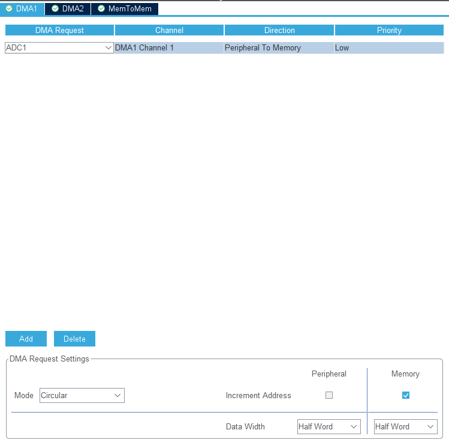

# Table-de-Mixage :  Conditionnement de signal
<!--
  Use this for formatting the image : 
  
  
   -->

Pour notre Table de Mixage nous avons besoins de (au moins) 2 entrées analogiques.
Cette partie de Projet est sur le conditionnement de ces signaux pour avoir un signal dans la plage de tension de notre entree de ADC [0; 3.3V].

Deux types de signaux sont possibles : 
- Amplifié niveau ligne $1.414 Vpk$

- Non Amplifié ( entre niveau micro et niveau ligne)

Dans les deux cas il faudrait amplifier et mettre un offset sur le signal pour être dans la plage de notre ADC de microcontrôleur.

## 1. Test Micro
On fait des mesures de tension sur notre  signale de micro pour avoir une idée de ce qu'on peux avoir en sortie d'un micro.

| $f_{\text{entrée}}[Hz]$ | $Vpp_{\text{micro}}[mV]$ |
| ----------------------- | ------------------------ |
| 100                     | 2.5                      |
| 200                     | 4                        |
| 300                     | 5.5                      |
| 400                     | 8                        |
| 500                     | 9.5                      |
| 1000                    | 11                       |
| 2000                    | 26                       |
| 3000                    | 40                       |
| 4000                    | 77                       |
| 5000                    | 230                      |
| 6000                    | 55                       |
| 7000                    | 20                       |
| 8000                    | 14.5                     |
| 10000                   | 17                       |

> [lien vers Excel](https://1drv.ms/x/c/44e5248c228d5751/ETUEaSnJRSJNqgbVf3nIVEgBYADid3KxOARgrQHJ6OK-Tg?e=khQeDF)

### 1. Initialisation du système

### 2. Configuration de l'ADC (Analog-to-Digital Converter)
#### 2.1. ADC : 

#### 2.2 : Timer : 

#### 2.3. DMA :

#### 2.4. Test pour vérifier la conversion analogique-numérique.

  

### 3. Traitement des données
- [ ] ........ UNDER CONSTRUCTION .........

### 4. Communication avec la Raspberry Pi
**- [ ] ........ UNDER CONSTRUCTION .........

**

### 5. Interface utilisateur et retour d’état
- [ ] ........ UNDER CONSTRUCTION .........

### 6. Sécurité et gestion des erreurs
- [ ] ........ UNDER CONSTRUCTION .........

###  7. Optimisation et validation finale

- [ ] ........ UNDER CONSTRUCTION .........

## Tests à réaliser pour validation
- [ ] ........ UNDER CONSTRUCTION .........

